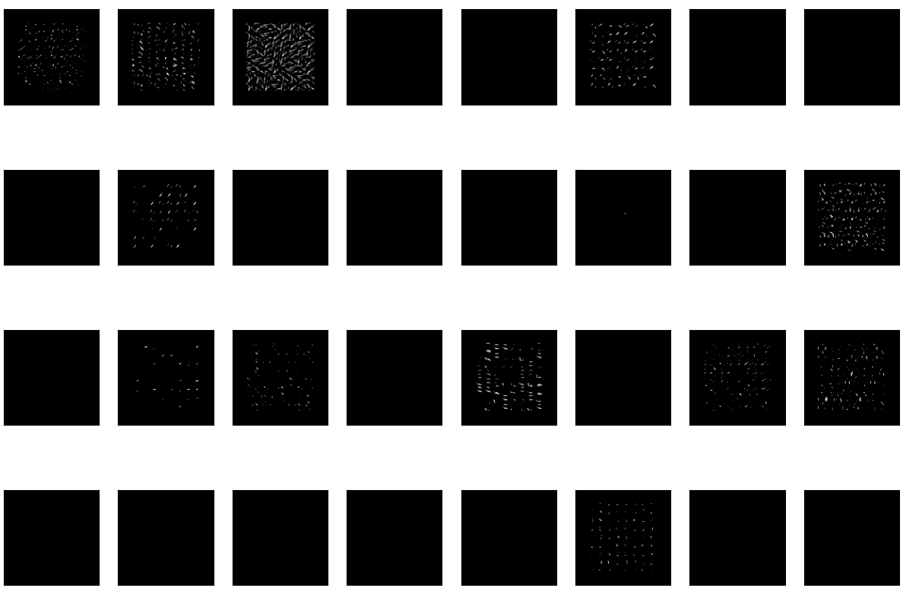

# Investigating the fitted filters on trained CNNs

## Methodology
File used: `/visualisation/visualise.py`
In order to look at the response of the filters visually, the filters were extracted from a saved tf model and ran on a single input image and the output was displayed, simulating the response of just the convolutional layer in the image. 

## Observations

We observed that in the large neuron models such as 32-neuron, there were a large number of filters that produced no output as seen in the image below. This led us to experiment with massively reducing the number of filters in our CNNs.

Significantly reducing the number of neurons in the first convolutional layer resulted in the decrease of accuracy, dropping as low as 57% accuracy on a 1-neuron layer 1 neural network. This follows as the amount of feature detector neurons and fitted convolutional filters were reduced, so orientation of regions could not be well determined. 