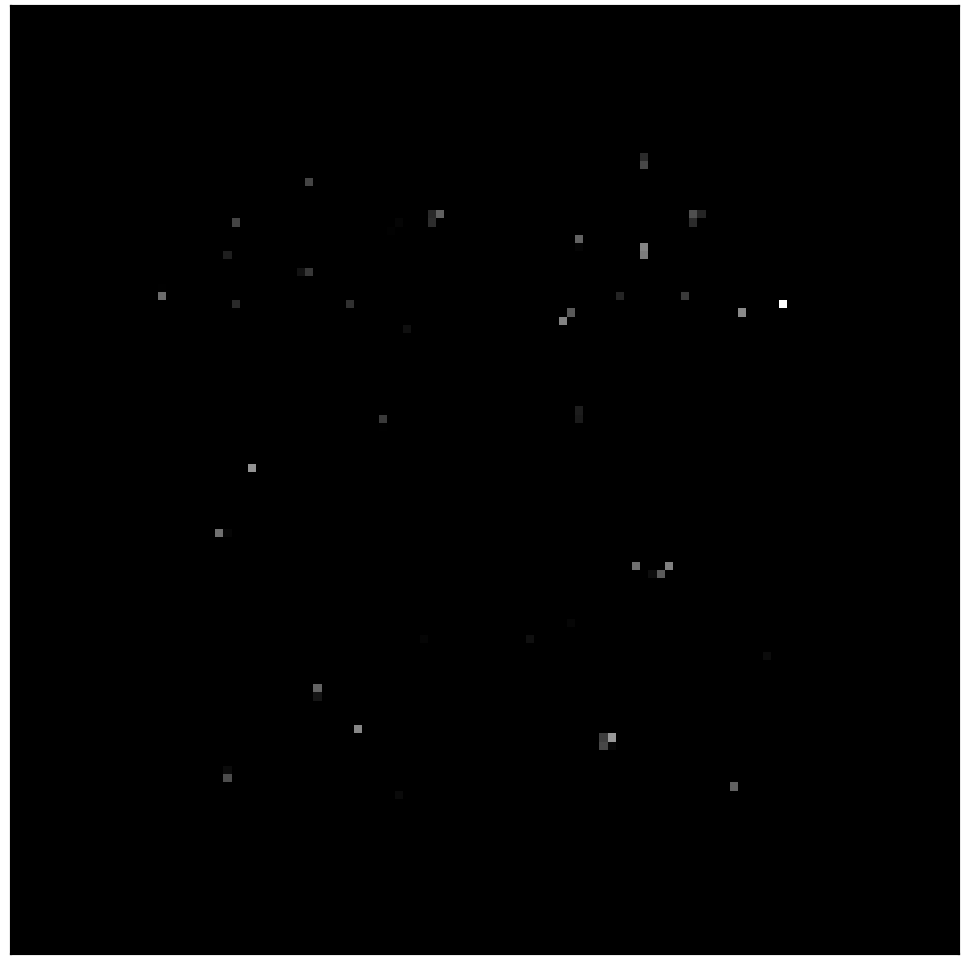
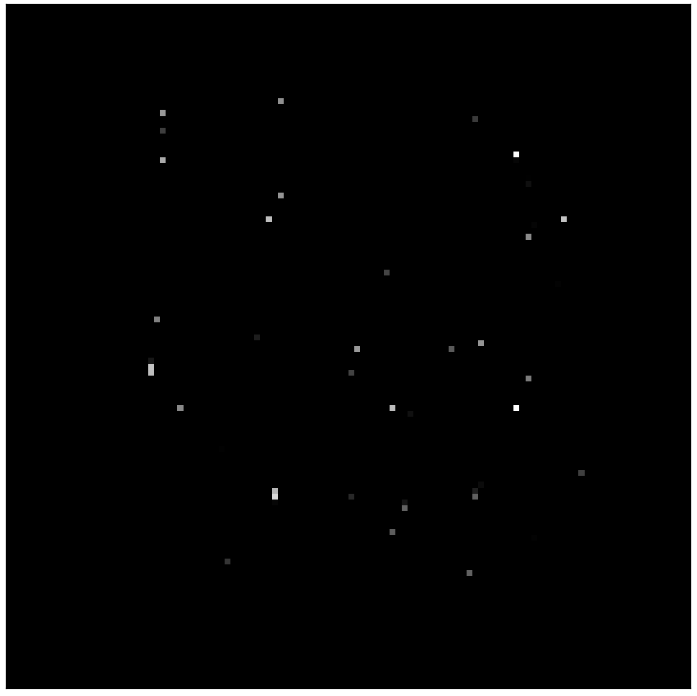

# Filter-Rectify Filter Model

## FRF
Filter-rectify filter is a 3 step process and a secondary image processing technique which involves filtering, the addition of a recitfication to normalise filter output then a final filtering as a output classifier.

- Filter step 1: a variety of filters exist at different orientations and receptive field sizes (n.b. only 1 receptive field size is used for the purpose of this reearch), and are all applied to the image producing positive and negative responses for each receptive field location along the image.
- Rectification step: the output from filter 1 is normalised in order to make sure a strong positive result is achieved if the receptive field matches up perfectly or opositely and no results is produced otherwise. This is because a the filter matches a dark and a light spot to find a boundary. In the case of a vertical filter with black on LHS and white on RHS, a input receptive field w/ white LHS and black RHS will give a negative result, where in fact the orientation is the same and should be counted as a positive match.
- Filter step 2: The rectified outputs are passed to a second filter which detects the global orientation based on the output from rectified filter - no rectification after is required becasue it is only interested in finding the appropriate texture boundary between high and low rectified outputs.

## How our model relates to FRF
- Filter step 1 = convolutional layer. Convolving the fitted convolutional filter with the kernels that move across the image is the same as the filtering step. Convolutional filters detect features in images, and in this case they will be orientation sensitive just like the filters used in a FRF model. __TODO: Inspect the convolutional filter directly to see what sort of action it does as a confirmation__
- Rectification step = nonlinearity (ReLU) activation function. The ReLu activation function removes all values below 0, which has the same effect of full-wave rectification (effectively absolute value) as it prevents negative filter matchings if the orientation is incorrect.

    
    

- Fitler step 2 = dense layer. The dense layer sums up the rectified filter output values times the weights with adjustment for bias, which does not immediately seem similar to a CNN: however, the presence of the weights and the weight adjustment suggests that only certain orientations will be assigned a large weighting, which allows the neural network to detect the overall orientation of the texture boundary in the image. In our case, we are instead only interested on the presence of a texture boundary or not, which is also accounted for by the weights on each neuron.

## References: 
https://www.ncbi.nlm.nih.gov/pmc/articles/PMC3094179/
https://www.researchgate.net/publication/10801661_Mechanism_independence_for_texture-modulation_detection_is_consistent_with_a_filter-rectify-filter_mechanism

# Investigating the fitted filters on trained CNNs

## Methodology
File used: `/visualisation/visualise.py`
In order to look at the response of the filters visually, the filters were extracted from a saved tf model and ran on a single input image and the output was displayed, simulating the response of just the convolutional layer in the image. 

## Observations

We observed that in the large neuron models such as 32-neuron, there were a large number of filters that produced no output as seen in the image below. This led us to experiment with massively reducing the number of filters in our CNNs.

Significantly reducing the number of neurons in the first convolutional layer resulted in the decrease of accuracy, dropping to 89% accuracy on a 1-neuron layer 1 neural network with 13 kernel size.. This follows as the amount of feature detector neurons and fitted convolutional filters were reduced, so orientation of regions could not be as well determined. 

Above: 1 neuron, 13 kernel size with no signal present.

Above: 1 neuron, 13 kernel size with  signal present.

## Investigating bias
As we only had a single convolutional neuron, the bias for our convolutional layer out was -0.028. Summing this value with the convolutional out, then is flattened and summed into a single value that is then passed to the sigmoidal classifier of the final output neuron with weight 0.138. This means we would expect a greater total intensity of pixels from the signal case, which can be seen from visually inspecting the image.

## What does the fitted kernel actually do
In order to figure out what the fitted kernel actually does and how it works, we investigated the kernels fitted in 1, 2 and 4 neuron models with kernel size 13.

